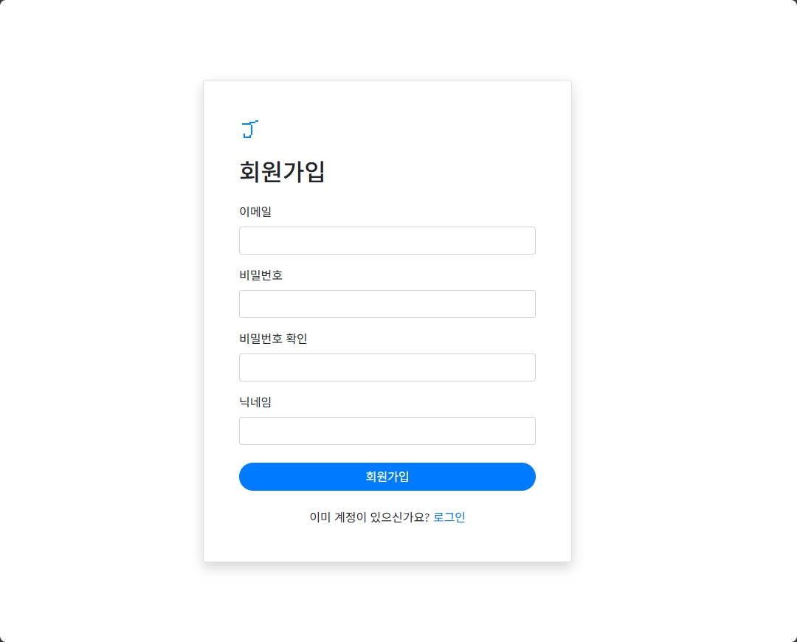
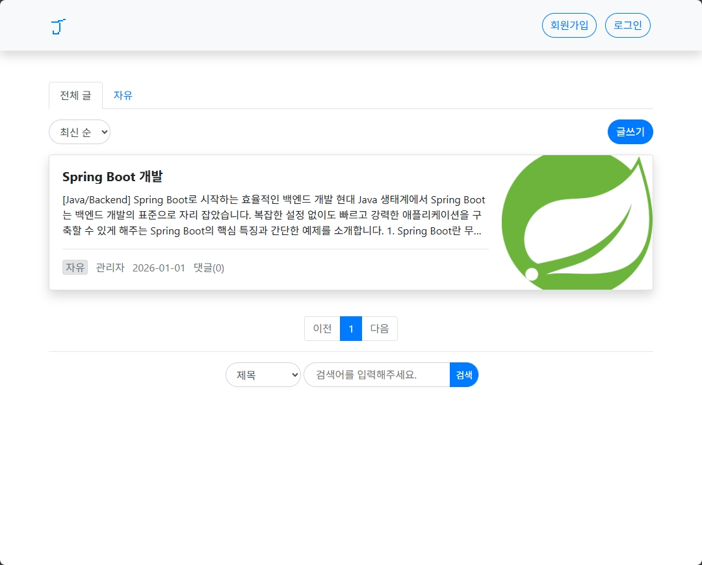

# 📝 Spring Boot Blog Project
Spring Boot를 기반으로 구축된 블로그 및 게시판 시스템입니다. 게시글의 생성, 조회, 수정, 삭제(CRUD)를 처리하는 백엔드 아키텍처와 사용자 친화적인 UI를 제공합니다.
<div align="center">
    
    
</div>

## 🚀 Quick Start
1. **Clone the Repository** - GitHub에서 프로젝트를 로컬로 다운로드합니다.
    ```bash
    git clone https://github.com/ginjae/springboot-blog.git
    cd springboot-blog
    ```
2. **Install Java 17** - 프로젝트 실행에 필요한 Java 17을 설치합니다.
    ```bash
    sudo apt update
    sudo apt install openjdk-17-jdk -y
    ```
3. **Run the Application** - Gradle을 사용하여 Spring Boot 애플리케이션을 시작합니다.
    ```bash
    chmod +x gradlew
    ./gradlew bootRun
    ```
4. **Access the Blog** - 웹 브라우저에서 http://localhost:8080/articles 로 접속합니다.

## ✨ Key Features
- **Article Management** - 게시글 CRUD (생성, 조회, 수정, 삭제) 기능
- **Comment System** - 게시글별 댓글 작성 및 삭제 기능
- **Category Management** - 카테고리 기반 게시글 분류 및 관리
- **User Authentication** - Spring Security 기반 회원가입 및 로그인
- **Role-Based Access Control** - 사용자/관리자 권한별 접근 제어
- **Admin Panel** - 관리자 전용 카테고리 및 사용자 관리 페이지
- **Search Functionality** - 제목, 작성자, 내용 기반 게시글 검색
- **Pagination** - 게시글 목록 페이지네이션
- **Markdown Support** - Markdown 형식으로 게시글 작성 및 HTML 렌더링
<!-- - **Global Exception Handling** - 일관된 에러 응답 처리 -->

## 🛠 Tech Stack
### Backend
- **Java 17** - 프로그래밍 언어
- **Spring Boot 3.4.1** - 웹 애플리케이션 프레임워크
- **Spring Data JPA** - ORM 및 데이터베이스 연동
- **Spring Security** - 인증 및 권한 관리
- **Spring Validation** - 데이터 유효성 검증

### Database
- **H2 Database** - 개발/테스트용 인메모리 데이터베이스
- **MySQL** - 프로덕션 데이터베이스

### Frontend
- **Thymeleaf** - 서버 사이드 템플릿 엔진
- **Thymeleaf-Extras-SpringSecurity6** - Spring Security 통합

### Library
- **Lombok** - 보일러플레이트 코드 자동 생성
- **CommonMark** - Markdown 파싱 및 HTML 변환
- **Jsoup** - HTML 파싱 및 이미지 추출

### Build Tool
- **Gradle 8.x** - 빌드 자동화 도구